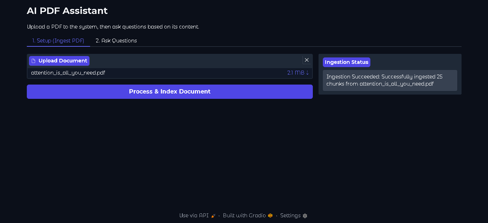
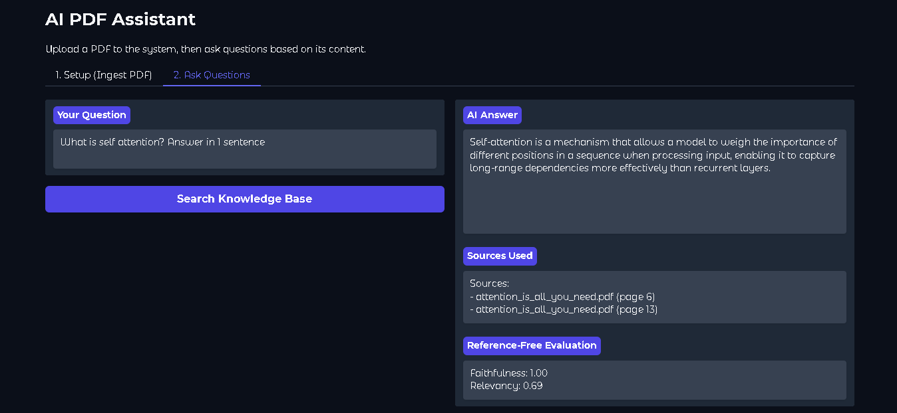

# AI PDF Assistant 
This application transforms static PDFs into an interactive knowledge base. Instead of relying on general pre-trained knowledge, the AI generates responses strictly from the content of your uploaded documents. To ensure reliability and build user confidence, the system utilizes an 'LLM-as-a-judge' framework to score every answer for faithfulness and relevance in real-time.

| Phase | Application Interface |
| :--- | :--- |
| **1. Ingestion** | <br>The document processing setup. This stage handles PDF loading, token-based chunking, and Pinecone vector indexing. |
| **2. Q&A + Evaluation** | <br>The interactive Q&A interface. This view displays the AI's answer, retrieved sources, and real-time Ragas scores (Faithfulness and Relevancy). |

### Features
- Document Ingestion: Extracts text and retains page-level metadata from uploaded files using PyPDFLoader.
- Token-Based Chunking: Splits text into 600-token chunks with a 150-token overlap using the gpt-4o tiktoken encoder to prevent information loss at chunk boundaries.
- Vector Search: Generates embeddings via OpenAI's text-embedding-3-small and stores them in a Pinecone Serverless index using cosine similarity.
- Strict Generation: Retrieves the 4 most relevant text chunks and generates answers using gpt-4o-mini with a temperature of 0 for highly factual, consistent outputs.
- Source Attribution: Automatically formats and returns the exact source filename and 1-indexed page number alongside the answer so users can verify claims.
- Automated Evaluation: Integrated the Ragas framework to provide real-time, reference-free evaluation of every response. The system uses an "LLM-as-a-judge" approach to calculate Faithfulness (detecting hallucinations) and Answer Relevancy (ensuring the query is addressed) directly within the UI.
- Web UI: Provides a straightforward, two-tab Gradio interface that separates the document ingestion setup from the querying environment.

### Installation
**Note**: This project was developed and tested using Python 3.12.2. It is highly recommended to use this version to avoid dependency conflicts, particularly with greenlet and langchain components.

1. Clone and Environment Setup (Windows)
```bash
git clone https://github.com/eliotjmartin/ai_pdf_assistant.git
cd ai_pdf_assistant
python -m venv myenv
myenv\Scripts\activate  
```
2. Install Dependencies
```bash
pip install --upgrade pip
pip install -r requirements.txt
```
3. Environment Variables

Create a .env file in the root directory:
```
OPENAI_API_KEY=your_openai_key
PINECONE_API_KEY=your_pinecone_key
PINECONE_INDEX=rag-pdf-demo
PINECONE_REGION=us-east-1
OPENAI_MODEL=gpt-4o-mini
```

### Usage
Start the app:

```bash
python app/app.py
```
- Ingest: Navigate to the "Setup" tab and upload your PDF.
- Chat: Switch to the "Ask Questions" tab and query your document.

### Project Structure
- app/app.py: Main entry point and user interface
- src/ingest.py: Logic for PDF processing and vector database upserting
- src/retrieve_and_answer.py: Logic for context retrieval and LLM response generation
- src/evaluate.py: Implementation of the Ragas-based evaluation pipeline using an "LLM-as-a-judge" approach.
- src/prompts.py: Central location for all prompts used in the RAG system